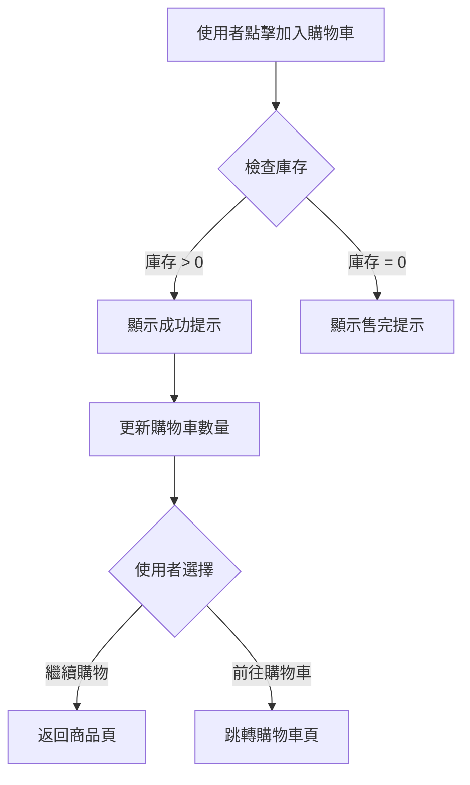

# 7. 互動流程與使用者行為

## 目的

透過流程圖和線框圖說明使用者的操作路徑和系統反應。

## 撰寫規範

### 基本結構

```markdown
## 互動流程與使用者行為

### 主要流程：新增商品至購物車

#### 流程圖
[此處插入線框圖或流程圖]

#### 流程說明
1. 使用者在商品頁點擊「加入購物車」按鈕
2. 系統檢查商品庫存
   - 若庫存 > 0：顯示「已加入購物車」提示，更新購物車數量
   - 若庫存 = 0：顯示「商品已售完」提示，按鈕變為灰色不可點擊
3. 使用者可選擇「繼續購物」或「前往購物車」

### 替代流程：使用者修改商品數量

#### 流程說明
1. 使用者在購物車頁面修改商品數量
2. 系統即時檢查庫存
   - 若修改後數量 ≤ 庫存：更新數量，重新計算總價
   - 若修改後數量 > 庫存：顯示「庫存不足」提示，數量自動調整為最大可購買數量
3. 使用者可繼續修改其他商品或結帳

### 異常流程：網路異常

#### 流程說明
1. 使用者點擊「加入購物車」後，網路連線中斷
2. 系統顯示「網路異常，請稍後再試」提示
3. 按鈕恢復可點擊狀態，使用者可重試
```

## 流程類型

### 1. 主要流程（Happy Path）
- **定義**：最常見、最順利的操作路徑
- **特點**：無異常、無錯誤、按預期完成
- **必要性**：每個功能都必須有主要流程

### 2. 替代流程（Alternative Flow）
- **定義**：不同於主要流程的其他成功路徑
- **範例**：
  - 使用者透過不同入口進入功能
  - 使用者選擇不同的操作方式
  - 系統提供多種選項供使用者選擇

### 3. 異常流程（Exception Flow）
- **定義**：遇到錯誤或異常情況時的處理路徑
- **範例**：
  - 網路異常
  - 權限不足
  - 資料驗證失敗
  - 系統錯誤

## 關鍵要素

### 1. 流程說明格式
每個步驟應包含：
- **使用者操作**：使用者做了什麼
- **系統反應**：系統如何回應
- **分支條件**：若有條件判斷，說明各分支的處理方式

### 2. 線框圖使用原則
- **目的**：表達「邏輯和流程」，而非視覺設計
- **內容**：包含主要元件、操作步驟、系統反饋
- **細節程度**：不需要包含顏色、字體、精確位置等設計細節
- **與設計稿的關係**：線框圖是邏輯，設計稿是視覺實現

### 3. 流程圖繪製工具
推薦工具：
- **Figma/Sketch**：線框圖和原型設計
- **Miro/Mural**：協作式流程圖
- **Draw.io/Lucidchart**：專業流程圖
- **Markdown**：文字描述流程（適合簡單流程）

## 撰寫技巧

### 技巧 1：區分使用者動作和系統反應
使用不同的表述方式：
- 使用者動作：「點擊」、「輸入」、「選擇」
- 系統反應：「顯示」、「檢查」、「更新」

### 技巧 2：標註條件分支
當流程有條件判斷時，明確標註：
```markdown
2. 系統檢查商品庫存
   - 若庫存 > 0：顯示「已加入購物車」提示
   - 若庫存 = 0：顯示「商品已售完」提示
```

### 技巧 3：使用編號組織流程
使用階層式編號，清楚呈現主流程和子流程：
```markdown
1. 使用者點擊按鈕
   1.1. 系統檢查權限
   1.2. 系統載入資料
2. 使用者輸入資料
   2.1. 系統驗證格式
   2.2. 系統儲存資料
```

### 技巧 4：涵蓋所有重要路徑
至少包含：
- 1 個主要流程
- 1-2 個替代流程（若有）
- 2-3 個異常流程（網路異常、權限不足等）

## Markdown 流程圖範例

### 使用 Mermaid 語法


### 使用文字描述
```markdown
使用者點擊「加入購物車」
  ↓
檢查商品庫存
  ├─ 庫存 > 0 → 顯示「已加入購物車」→ 更新購物車數量
  └─ 庫存 = 0 → 顯示「商品已售完」→ 按鈕變灰
```

## 注意事項

1. **線框圖不是設計稿**：不要在線框圖階段糾結視覺細節
2. **流程要完整**：從使用者進入到離開，完整描述整個流程
3. **異常要考慮**：不要只描述成功路徑，也要考慮失敗和異常情況
4. **與驗收標準對應**：流程中的每個分支都應有對應的驗收標準
5. **避免技術細節**：流程描述應聚焦在使用者體驗，而非技術實作

## 常見錯誤

❌ **錯誤示範 1**：流程描述不完整
```markdown
1. 使用者點擊按鈕
2. 商品加入購物車
```
**問題**：沒有說明系統如何反應、是否有條件判斷

✅ **正確示範**：
```markdown
1. 使用者點擊「加入購物車」按鈕
2. 系統檢查商品庫存
   - 若庫存 > 0：顯示「已加入購物車」提示，更新購物車數量
   - 若庫存 = 0：顯示「商品已售完」提示
```

❌ **錯誤示範 2**：混雜技術細節
```markdown
1. 使用者點擊按鈕
2. 前端發送 POST 請求至 /api/cart
3. 後端查詢資料庫檢查庫存
4. 回傳 JSON 格式的回應
```
**問題**：包含太多技術實作細節

✅ **正確示範**：
```markdown
1. 使用者點擊「加入購物車」按鈕
2. 系統檢查商品庫存
3. 系統更新購物車並顯示成功提示
```

❌ **錯誤示範 3**：缺少異常流程
```markdown
### 主要流程：新增商品至購物車
1. 使用者點擊按鈕
2. 商品加入購物車
3. 顯示成功提示
```
**問題**：只有成功路徑，沒有考慮異常情況

✅ **正確示範**：
```markdown
### 主要流程：新增商品至購物車
[成功路徑]

### 異常流程：網路異常
[網路異常處理]

### 異常流程：庫存不足
[庫存不足處理]
```

## 適用場景

- ✅ 設計階段，定義使用者操作流程
- ✅ 開發前，讓工程師理解功能邏輯
- ✅ 測試階段，作為測試案例的基礎
- ✅ 需求討論，幫助團隊對齊理解

## 與其他章節的關聯

- **使用者故事與情境**：流程是情境的具體化和細節化
- **功能詳述**：流程中的每個步驟會對應到功能詳述的驗收標準
- **邊界條件與異常處理**：異常流程會對應到邊界條件章節
- **資料與規則定義**：流程中涉及的資料操作需在資料章節定義

## 流程複雜度管理

### 簡單流程（3-5 步驟）
直接使用文字描述即可。

### 中等複雜流程（5-10 步驟）
建議使用流程圖輔助說明。

### 複雜流程（10+ 步驟）
- 拆分成多個子流程
- 使用階層式結構組織
- 考慮使用泳道圖（Swimlane Diagram）區分不同角色

## 驗證檢查

完成此章節後，檢查以下項目：
- [ ] 至少包含主要流程、替代流程、異常流程
- [ ] 每個步驟都清楚描述使用者動作和系統反應
- [ ] 條件分支有明確標註
- [ ] 流程與使用者故事對應
- [ ] 異常情況有考慮到網路、權限、驗證等常見問題
