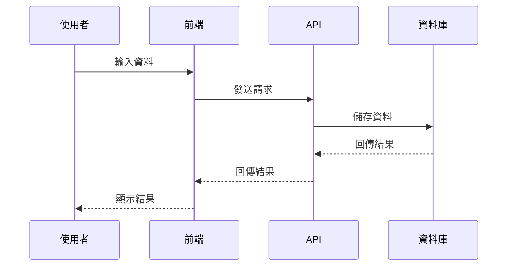

# 9. 資料與規則定義

## 目的

定義資料結構、欄位格式、驗證規則，讓工程師知道要處理什麼資料。

## 撰寫規範

### 基本結構

```markdown
## 資料與規則定義

### 購物車資料結構

#### 訪客購物車（localStorage）
\`\`\`json
{
  "cartId": "guest_20250203_abc123",
  "items": [
    {
      "productId": "P001",
      "productName": "商品名稱",
      "quantity": 2,
      "price": 1000,
      "imageUrl": "https://example.com/image.jpg"
    }
  ],
  "totalAmount": 2000,
  "createdAt": "2025-02-03T10:30:00Z",
  "updatedAt": "2025-02-03T10:35:00Z"
}
\`\`\`

### 欄位說明與驗證規則

| 欄位名稱 | 型別 | 必填 | 驗證規則 | 說明 |
|---------|------|------|---------|------|
| cartId | String | ✅ | - | 購物車唯一識別碼 |
| productId | String | ✅ | 格式：P + 3 位數字 | 商品 ID |
| productName | String | ✅ | 長度 ≤ 100 字元 | 商品名稱 |
| quantity | Integer | ✅ | 1 ≤ quantity ≤ 999 | 購買數量 |
| price | Integer | ✅ | ≥ 0 | 商品單價（單位：元） |
| totalAmount | Integer | ✅ | ≥ 0 | 總金額（自動計算） |

### 資料流向

\`\`\`
[前端] → [後端 API] → [資料庫]
  ↓           ↓            ↓
加入商品   檢查庫存    儲存購物車
  ↓           ↓            ↓
顯示結果   回傳結果    更新資料
\`\`\`

### 業務規則
1. **購物車數量上限**：訪客購物車最多 50 件商品，會員購物車最多 100 件商品
2. **商品數量上限**：單一商品最多購買 999 件
3. **資料保留期限**：訪客購物車資料保留 7 天，會員購物車永久保留
4. **價格計算規則**：總金額 = Σ (商品單價 × 購買數量)
```

## 關鍵要素

### 1. 資料結構
- **格式**：使用 JSON 格式範例
- **分類**：區分不同角色或場景的資料結構（如訪客 vs 會員）
- **完整性**：包含所有必要欄位
- **真實性**：使用真實或接近真實的範例資料

### 2. 欄位說明表格
包含以下欄位：
- **欄位名稱**：與 API 文件和程式碼一致
- **型別**：String、Integer、Boolean、Array、Object 等
- **必填**：使用 ✅ 或 ❌ 標示
- **驗證規則**：長度、範圍、格式、正則表達式等
- **說明**：欄位的用途和注意事項

### 3. 資料流向
- **目的**：說明資料如何在系統中流動
- **表現方式**：可使用文字圖、流程圖、時序圖
- **內容**：包含資料來源、處理步驟、儲存位置

### 4. 業務規則
- **定義**：影響資料處理的業務邏輯規則
- **內容**：數量限制、時間限制、計算公式等
- **優先級**：核心規則應優先列出

## 驗證規則撰寫原則

### 1. 資料型別驗證
```markdown
| quantity | Integer | ✅ | 必須為整數 | 購買數量 |
| email | String | ✅ | Email 格式 | 使用者信箱 |
| isActive | Boolean | ✅ | true 或 false | 帳號狀態 |
```

### 2. 長度驗證
```markdown
| productName | String | ✅ | 長度 ≤ 100 字元 | 商品名稱 |
| description | String | ❌ | 長度 ≤ 500 字元 | 商品描述 |
```

### 3. 範圍驗證
```markdown
| quantity | Integer | ✅ | 1 ≤ quantity ≤ 999 | 購買數量 |
| price | Integer | ✅ | ≥ 0 | 商品單價 |
| discount | Integer | ❌ | 0 ≤ discount ≤ 100 | 折扣百分比 |
```

### 4. 格式驗證
```markdown
| productId | String | ✅ | 格式：P + 3 位數字 | 商品 ID |
| phone | String | ✅ | 格式：09XX-XXX-XXX | 手機號碼 |
| date | String | ✅ | 格式：YYYY-MM-DD | 日期 |
```

### 5. 正則表達式驗證
```markdown
| email | String | ✅ | 正則：^[a-zA-Z0-9._%+-]+@[a-zA-Z0-9.-]+\.[a-zA-Z]{2,}$ | Email |
```

## 撰寫技巧

### 技巧 1：使用真實範例
❌ **抽象範例**：
```json
{
  "id": "xxx",
  "name": "name",
  "value": 123
}
```

✅ **真實範例**：
```json
{
  "productId": "P001",
  "productName": "iPhone 15 Pro",
  "price": 36900
}
```

### 技巧 2：區分必填和選填
使用符號清楚標示：
- ✅ 必填
- ❌ 選填

### 技巧 3：說明自動計算欄位
對於自動計算的欄位，應說明計算公式：
```markdown
| totalAmount | Integer | ✅ | 自動計算：Σ (price × quantity) | 總金額 |
```

### 技巧 4：標註單位
對於有單位的數值，應明確標註：
```markdown
| price | Integer | ✅ | ≥ 0（單位：元） | 商品單價 |
| weight | Integer | ✅ | ≥ 0（單位：公克） | 商品重量 |
| timeout | Integer | ✅ | 範圍：1-60（單位：秒） | 逾時時間 |
```

## 資料流向表現方式

### 方式 1：文字描述
```markdown
1. 前端接收使用者輸入
2. 前端發送請求至後端 API
3. 後端驗證資料格式
4. 後端儲存至資料庫
5. 後端回傳結果至前端
6. 前端顯示結果給使用者
```

### 方式 2：簡單圖示
```markdown
[前端] → [API] → [資料庫]
  ↓       ↓        ↓
輸入    驗證     儲存
  ↓       ↓        ↓
顯示    回傳     更新
```

### 方式 3：Mermaid 時序圖


## 業務規則類型

### 1. 數量限制
```markdown
- 購物車最多 100 件商品
- 單一商品最多購買 999 件
- 單筆訂單最多 50 個商品品項
```

### 2. 時間限制
```markdown
- 訪客購物車資料保留 7 天
- 訂單未付款超過 30 分鐘自動取消
- 退貨申請期限為收貨後 7 天內
```

### 3. 計算公式
```markdown
- 總金額 = Σ (商品單價 × 購買數量)
- 折扣金額 = 總金額 × 折扣百分比 / 100
- 應付金額 = 總金額 - 折扣金額 + 運費
```

### 4. 狀態轉換規則
```markdown
- 訂單狀態：待付款 → 已付款 → 出貨中 → 已送達 → 已完成
- 商品只能從「待付款」狀態取消
- 商品只能在「已送達」後 7 天內申請退貨
```

## 注意事項

1. **與 API 文件一致**：欄位名稱、型別、格式應與 API 文件保持一致
2. **驗證規則要明確**：避免「合理範圍」、「適當長度」等模糊描述
3. **考慮邊界情況**：0、空字串、null、最大值等邊界情況要明確定義
4. **單位要標註**：時間、金額、重量等數值要標註單位
5. **計算公式要清楚**：對於自動計算的欄位，要說明計算邏輯

## 常見錯誤

❌ **錯誤示範 1**：驗證規則不明確
```markdown
| quantity | Integer | ✅ | 必須合理 | 購買數量 |
```
**問題**：「合理」是主觀的，無法驗證

✅ **正確示範**：
```markdown
| quantity | Integer | ✅ | 1 ≤ quantity ≤ 999 | 購買數量 |
```

❌ **錯誤示範 2**：缺少單位
```markdown
| price | Integer | ✅ | ≥ 0 | 商品單價 |
```
**問題**：不知道單位是元、美金、還是其他

✅ **正確示範**：
```markdown
| price | Integer | ✅ | ≥ 0（單位：元） | 商品單價 |
```

❌ **錯誤示範 3**：JSON 格式錯誤
```json
{
  "productId": P001,
  "productName": 商品名稱,
}
```
**問題**：字串未加引號、結尾多餘逗號

✅ **正確示範**：
```json
{
  "productId": "P001",
  "productName": "商品名稱"
}
```

## 適用場景

- ✅ 開發階段，工程師根據資料結構實作功能
- ✅ API 設計階段，定義請求和回應格式
- ✅ 資料庫設計階段，定義資料表結構
- ✅ 測試階段，驗證資料格式和驗證規則

## 與其他章節的關聯

- **名詞定義**：欄位名稱應與名詞定義一致
- **功能詳述**：驗收標準中的資料操作應對應此章節的定義
- **邊界條件與異常處理**：驗證規則的邊界情況應在邊界條件章節說明
- **外部依賴與技術約束**：資料結構可能受外部 API 或技術約束影響

## 延伸：API 文件整合

若專案有 API 文件（如 Swagger、Postman），應：
1. 在 PRD 中提供 API 文件連結
2. 確保 PRD 的資料結構與 API 文件一致
3. 若有差異，應在 PRD 中說明原因

```markdown
### API 文件參考
- 購物車 API：[Swagger 文件](https://api.example.com/docs/cart)
- 商品 API：[Swagger 文件](https://api.example.com/docs/product)
```

## 驗證檢查

完成此章節後，檢查以下項目：
- [ ] 資料結構使用 JSON 格式且格式正確
- [ ] 所有欄位都有型別、必填、驗證規則、說明
- [ ] 驗證規則明確且可測試
- [ ] 數值有標註單位
- [ ] 業務規則清楚說明數量、時間、計算邏輯
- [ ] 欄位名稱與名詞定義一致
- [ ] 資料結構與 API 文件一致（若有）
